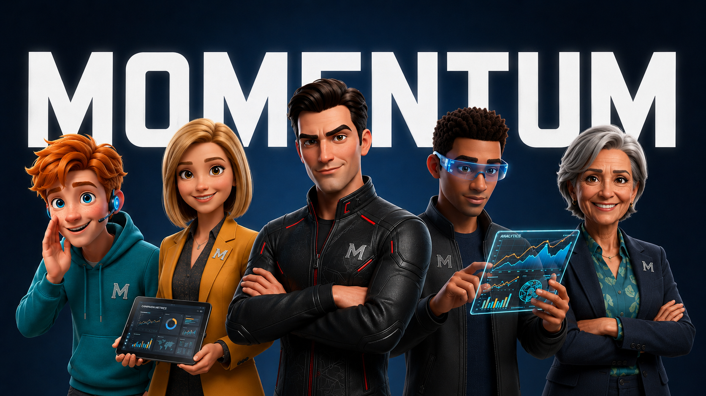

<p align="center">
  
</p>

```
+----------------------------------------------------------------- v1.0 --+
|                                                                          |
|  __  __   ___   __  __  _____  _   _  _____  _   _  __  __             |
| |  \/  | / _ \ |  \/  || ____|| \ | ||_   _|| | | ||  \/  |            |
| | |\/| || | | || |\/| ||  _|  |  \| |  | |  | | | || |\/| |            |
| | |  | || |_| || |  | || |___ | |\  |  | |  | |_| || |  | |            |
| |_|  |_| \___/ |_|  |_||_____||_| \_|  |_|   \___/ |_|  |_|            |
|                                                                          |
+--------------------------------------------------------------------------+
```

<p align="center"><strong>The complete AI business system for solopreneurs.</strong></p>

<br>

<p align="center">
  
  &nbsp;&nbsp;→&nbsp;&nbsp;
  
  &nbsp;&nbsp;→&nbsp;&nbsp;
  
  &nbsp;&nbsp;→&nbsp;&nbsp;
  
  &nbsp;&nbsp;→&nbsp;&nbsp;
  
</p>

<br>

A Claude Code agent that builds a complete business strategy for any 1-person service business. Built on frameworks from Alex Hormozi ($100M Offers, $100M Leads), Daniel Priestley (Oversubscribed, Key Person of Influence), and Russell Brunson (DotCom Secrets, Expert Secrets).

Type `/momentum` to start. Answer 7 questions. Get a complete 90-day action plan.

---

## The Business Loop

Every 1-person service business runs the same loop:

```
OFFER → ATTENTION → CONVERSION → DELIVERY → FEEDBACK
```

All 11 agents map to a stage. Run them in order from scratch, or jump to the stage you need.

| Stage | Agent | Command | What it does | When to run |
|-------|-------|---------|--------------|-------------|
| **OFFER** | Brand Voice | `/brand-voice` | Foundation: story, positioning, bios, tone | Before anything else — sets your story and voice for all content |
| | Hunter | `/hunter` | Validate the market — confirm who the offer is for | When starting a new niche or offer |
| | Alchemist | `/alchemist` | Build the Grand Slam Offer: name, stack, guarantee, price | After Hunter returns green or amber |
| **ATTENTION** | Amplifier | `/amplifier` | Daily outreach + content engine (Core Four, Rule of 100) | After Alchemist — offer is named and priced |
| | Content Engine | `/content-engine` | Multi-platform content: LinkedIn, TikTok, IG, Skool | Any time you need platform-ready content from a single topic |
| | Funnel Architect | `/funnel-architect` | Lead magnet, landing page, email sequence, booking funnel | After Amplifier — when content is consistent and you need structured lead capture |
| **CONVERSION** | Converter | `/converter` | CLOSER talk track, pre-call brief, follow-up scripts | After Amplifier — before your first discovery call |
| **DELIVERY** | Client Onboard | `/client-onboard` | Professional first 7 days after close | The day a client closes |
| **FEEDBACK** | Loop Engine | `/loop-engine` | Reactivation sequences, referrals, objection log | After 4+ weeks of outreach or after first client |
| | Case Study | `/case-study` | Document results — turn them into proof and content | After a client gets their first visible result |
| **META** | Weekly Sprint | `/weekly-sprint` | Breaks any stage's tasks into a Mon–Fri executable schedule | Every Monday — or auto-triggered by `/momentum` |

`/momentum` is the orchestrator — runs Hunter → Alchemist → Amplifier → Converter → Loop Engine in one pass and produces a complete 90-day plan.

---

## What It Does

Runs 5 specialized agents in sequence, each building on the last:

| Agent | Command | Output | When to run |
|-------|---------|--------|-------------|
| Hunter | `/hunter` | Validated market, avatar, green/amber/red verdict | Starting point — validate before building anything |
| Alchemist | `/alchemist` | Named Grand Slam Offer, value stack, guarantee, price | After Hunter returns green or amber |
| Amplifier | `/amplifier` | Daily outreach rhythm, 3 DM templates, 3 content hooks | After Alchemist — offer is named and priced |
| Converter | `/converter` | CLOSER talk track, pre-call brief, follow-up scripts | After Amplifier — when discovery calls start |
| Loop Engine | `/loop-engine` | Reactivation sequences, referral asks, objection log | After 4+ weeks of outreach or after first client |

The orchestrator (`/momentum`) runs all 5 and compiles a single `90-day-plan.html` at the end — a styled, print-ready HTML file branded to your colors.

**Each agent can also be run standalone** — useful if you already have a validated market and just want to build the offer, or if you want to rerun one agent after updating your inputs.

---

## The Agents

### 1. Hunter — Validate the Market
Before building anything, Hunter stress-tests whether the market is worth entering. It applies Hormozi's 4-filter criteria (massive pain, purchasing power, targetability, growth), checks whether the niche is too broad or too thin, and builds a precise avatar with the exact words buyers use to describe their problem — not marketing language, their actual words. Returns a green / amber / red verdict. A red verdict stops the chain before you waste time building an offer for a dead market.

### 2. Alchemist — Build the Grand Slam Offer
Takes the validated market and builds an offer that cannot be compared to a competitor's price. Walks through Hormozi's 5-step process: dream outcome, obstacle list, solutions, delivery vehicles, and trim-and-stack. Assigns a dollar value to each component so the total value stack dwarfs the asking price. Runs a Value Equation audit, drafts a conditional guarantee, and generates 3 offer name options using the MAGIC formula (Magnetic reason why + Avatar callout + Goal + Interval + Container word).

### 3. Amplifier — Design the Outreach and Content Engine
Builds the daily system to get the offer in front of the right people. Applies Hormozi's Core Four priority order — warm outreach first, content second, cold outreach third, paid ads last (and only after Rung 2). Designs a Rule of 100 daily rhythm (100 touches or 100 minutes of content per day). Writes 3 ACA DM templates (Acknowledge, Compliment, Ask) specific to the offer's avatar and 3 Hook-Retain-Reward content units using the avatar's own pain language. Recommends 1-2 platforms based on where the avatar actually gathers.

### 4. Converter — Build the Sales System
Turns conversations into closed clients. Builds a full CLOSER talk track (Clarify, Label, Overview, Sell the vacation, Explain away concerns, Reinforce the decision) written specifically for this offer — not a generic script. Applies two critical reframes: diagnose before prescribing and lead with the prospect's pressure, not the technology. Also produces a pre-call brief template to fill in before every call, a post-call follow-up email to send within 5 minutes of hanging up, and a same-day onboarding message to send the day you close.

### 5. Loop Engine — Keep the Momentum
Most revenue is lost in the silence after a sales conversation. Loop Engine closes that gap. Builds a closed-client sequence that captures testimonials at the right moment and asks for referrals in 3 different ways. Creates a 4-message "no" reactivation sequence at 7, 14, 30, and 90 days — using Dean Jackson's 9-word email format at days 14 and 90. Builds a 3-step ghost bump sequence for prospects who went cold mid-conversation. Includes an objection log template that feeds back into the Alchemist to continuously improve the offer.

---

## Setup

### Requirements

- Claude Code (CLI or desktop app)
- Claude API access (any tier works — Haiku is fine for speed; Sonnet for quality)

### Installation

1. Clone or download this repo
2. Copy the `.claude/skills/` folder into your Claude Code project's `.claude/skills/` directory:

```
your-project/
  .claude/
    skills/
      momentum/       ← copy from here
      hunter/         ← copy from here
      alchemist/      ← copy from here
      amplifier/      ← copy from here
      converter/      ← copy from here
      loop-engine/    ← copy from here
```

3. Open your project in Claude Code
4. Type `/momentum` to start

### No external dependencies

All frameworks are embedded directly in each skill file. No books, PDFs, or external knowledge bases required. Works on any machine with Claude Code installed.

---

## Usage

### Full system (recommended)
```
/momentum
```
Runs the intake interview, confirms your profile, fires all 5 agents in sequence, and produces a `90-day-plan.md`.

### Individual agents
Each agent can be run standalone. Pass the project folder path as the argument:

```
/hunter        "I help freelance designers get more retainer clients"
/alchemist     projects/momentum/freelance-designers/
/amplifier     projects/momentum/freelance-designers/
/converter     projects/momentum/freelance-designers/
/loop-engine   projects/momentum/freelance-designers/
```

When run standalone, each agent asks for missing inputs if needed.

---

## Output

All files are saved to `projects/momentum/[your-business-slug]/`:

```
projects/momentum/[slug]/
  profile.md        — your intake answers
  market.md         — Hunter output
  offer.md          — Alchemist output
  outreach.md       — Amplifier output
  sales.md          — Converter output
  follow-up.md      — Loop Engine output
  90-day-plan.html  — compiled final plan (styled HTML, print-ready, branded to your colors)
```

Start with `90-day-plan.html`. Open it in any browser. It contains everything you need without opening any sub-file.

---

## Frameworks Used


- **4-filter market test** — validates whether a market is worth pursuing
- **Grand Slam Offer creation** — 5-step process to build an incomparable offer
- **Value Equation** — (Dream Outcome × Perceived Likelihood) / (Time Delay × Effort)
- **MAGIC naming formula** — names the offer using avatar, goal, interval, and container word
- **Core Four advertising** — warm outreach → content → cold → paid ads (priority order)
- **ACA framework** — Acknowledge, Compliment, Ask (warm DM structure)
- **Rule of 100** — 100 outreach touches or 100 content minutes per day
- **Hook → Retain → Reward** — content unit structure
- **CLOSER framework** — Clarify, Label, Overview, Sell, Explain, Reinforce (sales call structure)
- **Dean Jackson 9-word email** — reactivation message format

---

## Extended Agents

Six additional agents that extend the Momentum system into a complete Solopreneur OS. Install alongside the core 5 by copying their skill folders into `.claude/skills/`.

| Agent | Command | What it does | When to run |
|-------|---------|--------------|-------------|
| Brand Voice | `/brand-voice` | Builds the personal brand foundation: signature story, positioning one-liner, content pillars, platform bios (LinkedIn/TikTok/IG/Skool), tone/voice guide, and a 7-11-4 gap audit | Run once before Content Engine or Funnel Architect |
| Content Engine | `/content-engine` | Takes one topic → LinkedIn post, TikTok/Reels script, Instagram caption, Skool post, repurposing map, and a 30-day content calendar | Any time you need platform-ready content from a single topic |
| Funnel Architect | `/funnel-architect` | Builds the lead gen funnel: lead magnet concept, landing page copy, 5-email welcome sequence, platform bio CTAs, weekly posting rhythm, and a booking page brief | After Amplifier — when content is consistent and you need a structured lead capture layer |
| Case Study | `/case-study` | Turns a client result into proof: pre-interview questions, before/after one-pager, LinkedIn story post, DM proof piece, and a referral ask template | After a client gets their first visible result |
| Client Onboard | `/client-onboard` | Builds the professional first-7-days system: welcome message, kick-off call agenda, project brief, first-week milestone checklist, and communication cadence | The day a client closes |
| Weekly Sprint | `/weekly-sprint` | Reads the 90-day plan and produces a specific Mon–Fri schedule for the current week, with Rule of 100 tracking, a daily log habit, and a Friday review | Every Monday — or auto-triggered by `/momentum` |

### The Extended Agent Descriptions

**Brand Voice** is the foundation everything else builds on. Run it once before using Content Engine or Funnel Architect. It ensures that every piece of content sounds like the same person wrote it — and that the person it sounds like is the version of you that earns trust quickly.

**Content Engine** closes the gap Amplifier leaves open. Amplifier gives you 3 content hooks. Content Engine turns those hooks — or any topic — into four platform-ready pieces in one pass. LinkedIn post, TikTok script, Instagram captions (3 variants), and a Skool post. Plus a repurposing map that explains the logic so you can replicate it.

**Funnel Architect** builds the conversion layer between your content and your calendar. Content builds audience. The funnel captures that audience and moves the most interested people toward a discovery call. Without a funnel, growth stalls at followers who never take the next step.

**Case Study** closes the proof loop. The moment a client gets a result, this agent documents it before the memory fades. One good result, structured correctly, produces months of content and a referral ask that works because the evidence is right there.

**Client Onboard** sets the professional tone that earns referrals. The first 7 days after a client closes define whether they tell others or stay quiet. A disorganized onboarding loses referrals before the work even starts. This agent makes you look like you've done it a hundred times, even on the first.

**Weekly Sprint** makes the 90-day plan executable. A 90-day plan without weekly execution is a vision board. This agent takes the plan, determines what week you're on, and builds a specific Mon–Fri task list with daily outreach targets, content goals, and a Friday review to carry forward what matters.

---

## Credits

**Created by:** Muhammad Haris — [mharis.ca](https://mharis.ca)

**Frameworks:** Alex Hormozi — $100M Offers, $100M Leads (Acquisition.com) | Daniel Priestley — Oversubscribed, Key Person of Influence (Dent Global) | Russell Brunson — DotCom Secrets, Expert Secrets (ClickFunnels)

Built as a Claude Code agent. A Claude Code agent is a set of skills — plain markdown files that give Claude a set of instructions, frameworks, and saved behaviors to follow. No code, no dependencies, no API keys beyond your Claude subscription.

---

## Disclaimer

**The Business Loop** (Offer → Attention → Conversion → Delivery → Feedback) is a framework created by Muhammad Haris. All rights reserved.

This project is an independent educational tool built for personal productivity purposes. It is not affiliated with, endorsed by, or officially connected to Alex Hormozi / Acquisition.com, Daniel Priestley / Dent Global, Russell Brunson / ClickFunnels, or Nate Herk.

All frameworks, concepts, and methodologies referenced in this agent are the intellectual property of their respective creators. This agent draws only from publicly available information — books, public interviews, YouTube videos, and publicly accessible content published by each author.

No proprietary materials, licensed content, or private intellectual property has been reproduced. References to named frameworks (e.g., "Grand Slam Offer," "Value Ladder," "7-11-4") are used for descriptive and educational purposes only, in the same way a student might apply a concept they learned from a book.

This tool does not claim to represent, replicate, or substitute any official product, program, or service offered by any of the referenced creators or their organizations.
